### Public Spaces 2023

  
  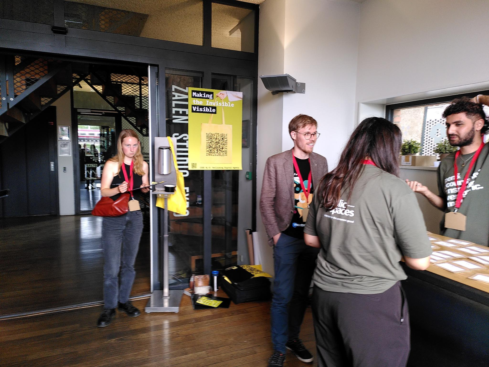
  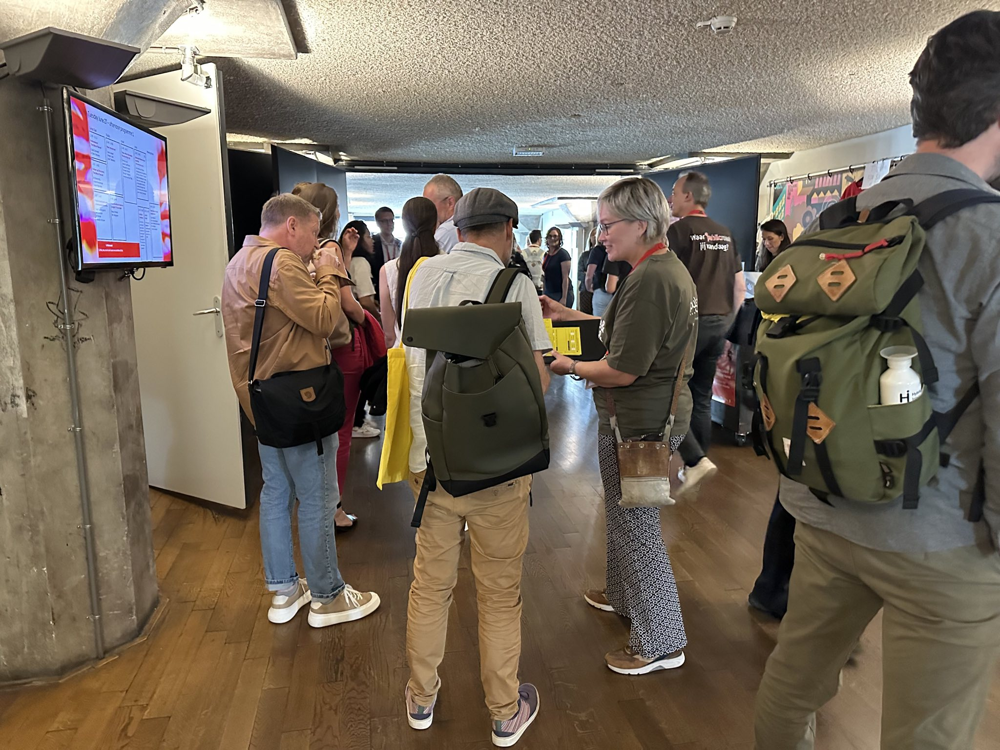
  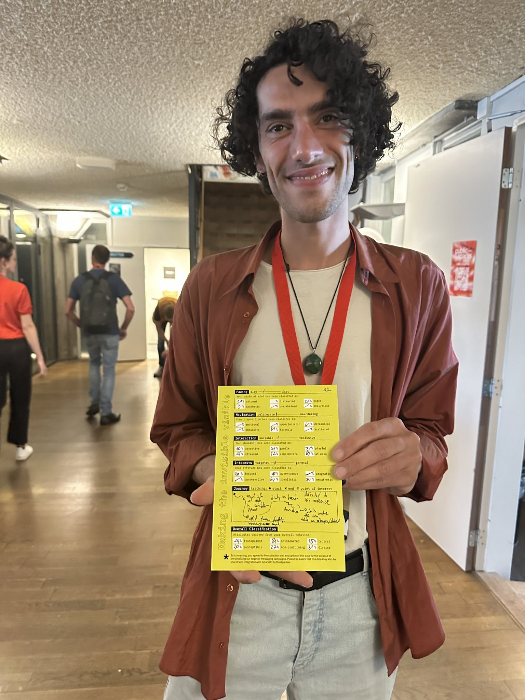
  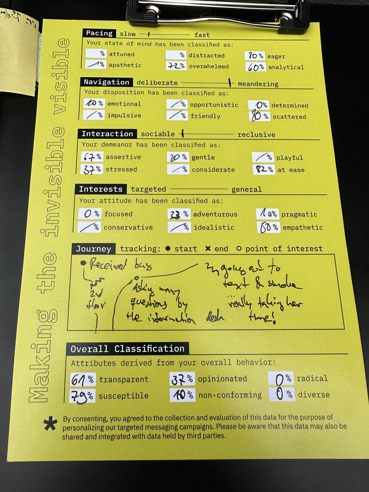

### re:publica 22

  
  
  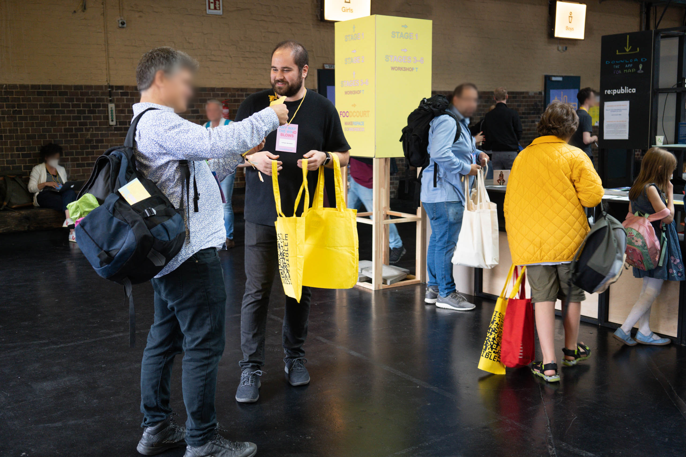
  
  
  
  
  
  
  
  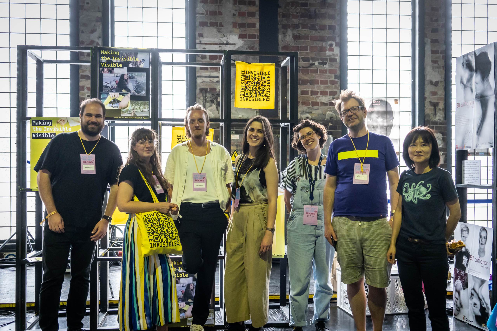

### Manifestations

  
  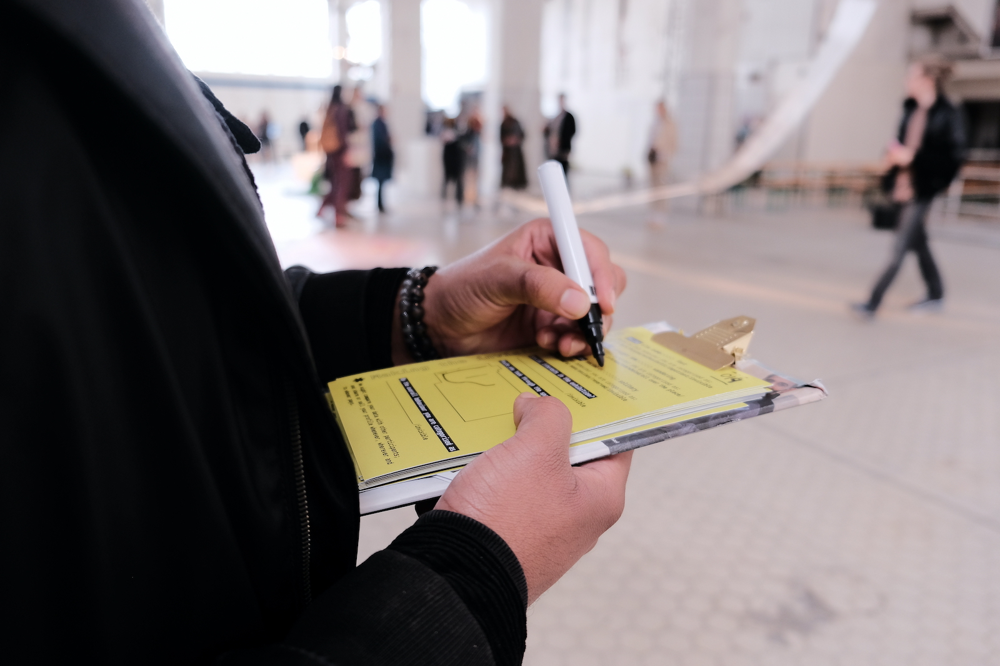
  
  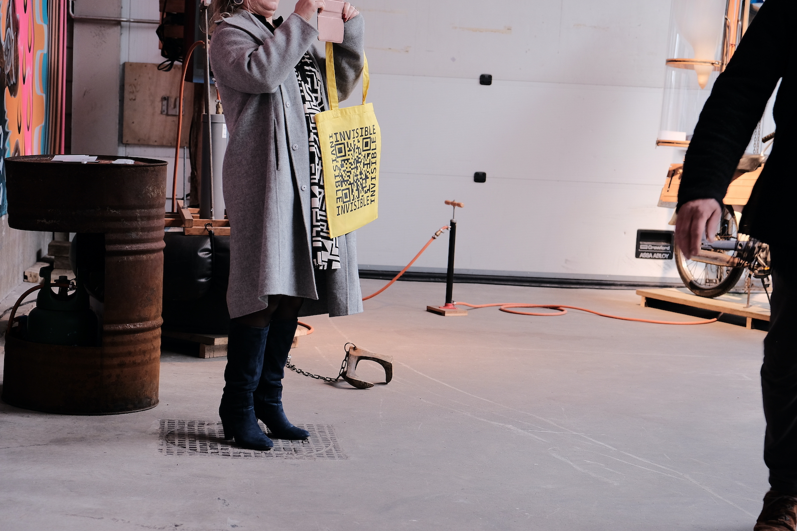
  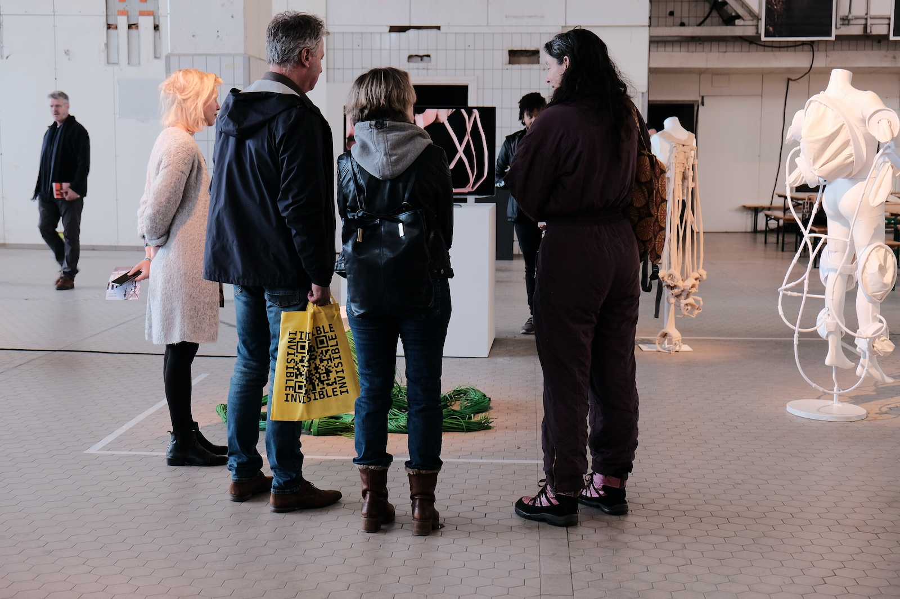
  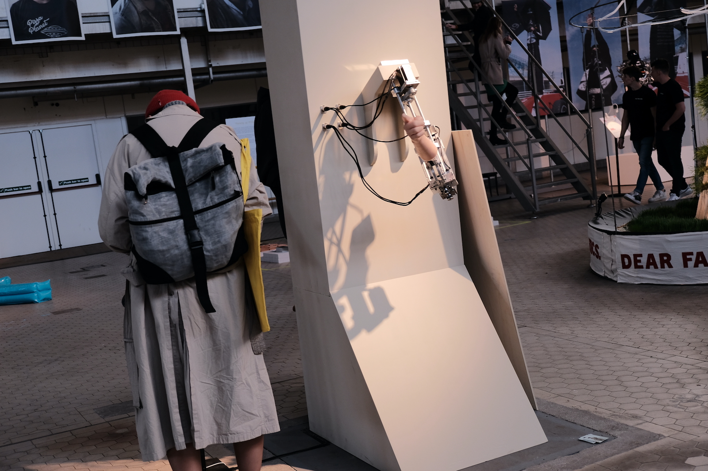
  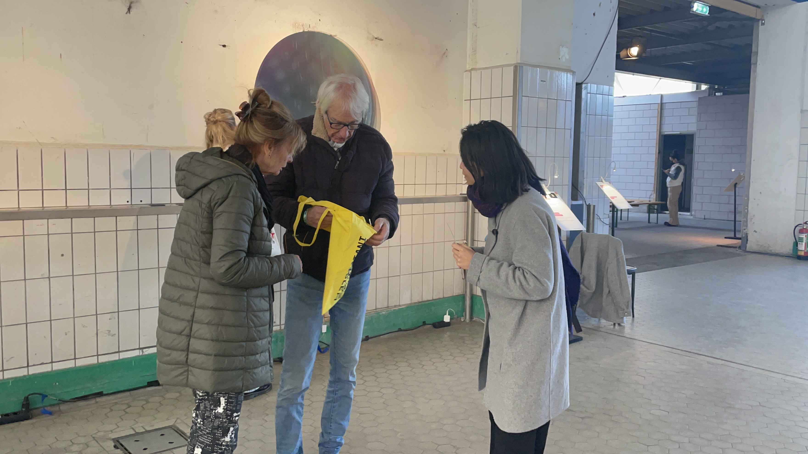
  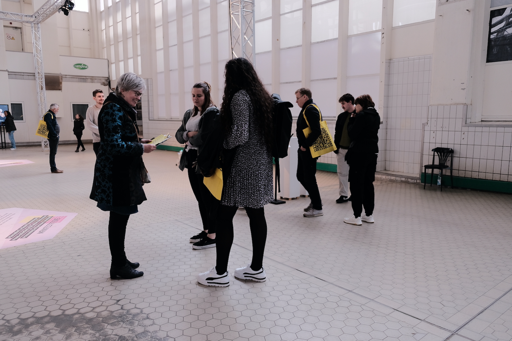
  
  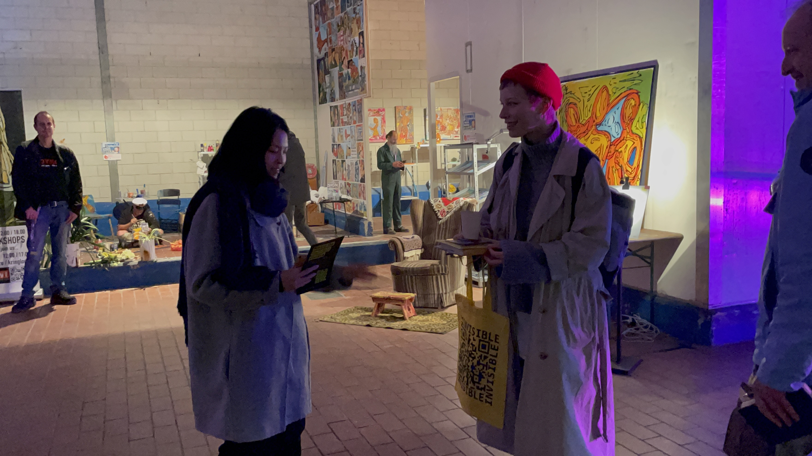
  

    &times;
     <!-- Prevent closing when clicking on the image -->

