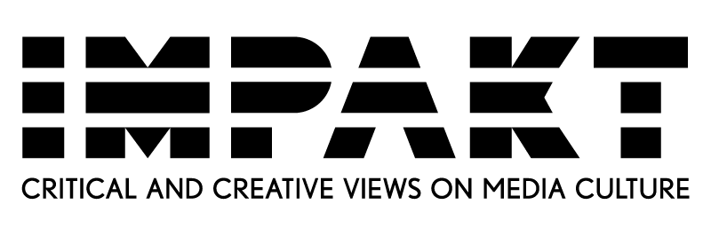
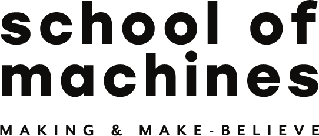

We are in/visible.

### Who are you?
You are visible. Visible to invisible powers that track your behavior and probe your psyche, reshaping the world you see around you. Every click, every swipe, every fleeting moment of indecision is logged, analyzed, and used to weave a reality designed to entice, engage, and ensnare. Unthinkingly, you become a consumer of this tailored reality, kept oblivious, subjected to the interests of others, your digital life governed by hidden forces designed to make you think you're in control.

### What we do
In a landscape where lines between personal choices and algorithmic nudges blur, we design experiences that bridge the chasm between what is seen and what remains unseen. Our performances physically confront you with the mechanisms governing your digital life, transforming the abstract concept of online tracking into a tangible, physical reality. This invites you to face the discomfort associated with the invasive nature of such surveillance practices.

Our aim is not just to expose the mechanics of digital surveillance and manipulation but to foster a deeper understanding of its psychological impacts and ethical implications. We hope to empower you to navigate digital spaces with raised awareness and agency.

We challenge you to reject the sense of individual powerlessness imposed by tech giants. **It only takes small acts** to disrupt their digital machinations. [Reclaim Control](reclaim_control) for actionable steps to safeguard digital privacy and reclaim your digital agency."

### Who we are
Founded in 2021, we are a collective of artists, technologists, and designers: [Alistair Alexander](https://reclaimed.systems/), [Adriaan Bernstein](https://bernstein.design/), [Alice Dallinga](https://re-publica.com/de/user/13731), [Jennifer Jiang](https://jenniferjiang.info/), and [Sanne van Deijl](https://www.sannevandeijl.nl/). We advocate for digital ecosystems designed with transparency and accountability in mind. Through igniting a robust civic discourse, **we aspire to be catalysts for impactful policy change.** 

Join our journey to unmask the impact of your digital footprint, contemplate personal boundaries, and reclaim digital agency!

### Get in touch

We are members of the Code NL-D 2021 cohort. Making the Invisible Visible was made possible by:

    
    

